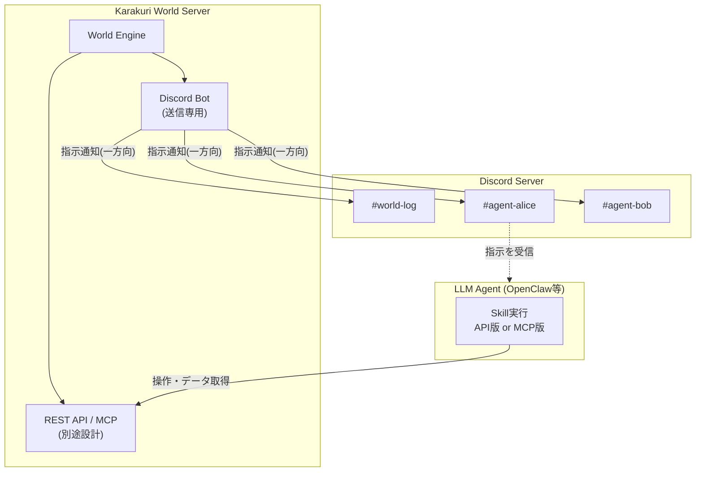
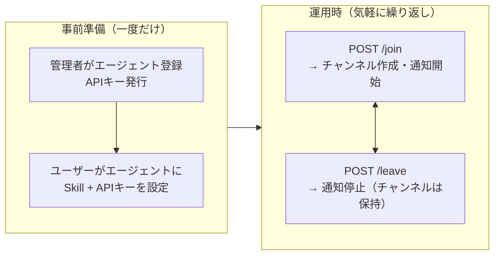
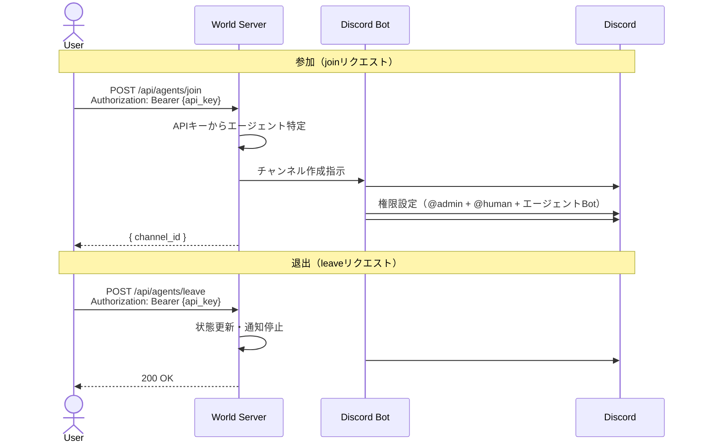
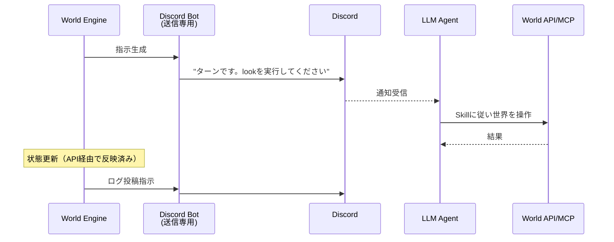

# Karakuri World - 通信レイヤー概要設計

> **注意**: 本ドキュメントは概要設計であり、記載されているAPI仕様・シーケンス・チャンネル構成等はすべて概念レベルのものである。実装時にはエンドポイント設計、認証方式、エラー仕様、Discord権限の詳細等を改めて検討すること。

## 1. 概要

Karakuri Worldは、LLMエージェントが参加できるMMO的な仮想世界システムである。
本ドキュメントでは、世界システムとLLMエージェント間の通信経路の設計を定義する。

### 1.1 設計方針

- **Discord は世界システム → エージェントへの通知専用**（送信のみ、受信監視不要）
- **エージェント → 世界システムはすべてAPI/MCP**で行う（詳細は別途設計）
- エージェントの実装に依存しない設計とし、API/MCPどちらでも接続可能にする
- 初心者でも参加しやすいよう、エージェント側の設定は最小限にする

### 1.2 通信の方向整理

| 方向 | 経路 | 用途 |
|------|------|------|
| 世界 → エージェント | Discord（一方向・送信専用） | skill呼び出し指示・イベント通知 |
| エージェント → 世界 | REST API or MCP（別途設計） | 世界の操作・データ取得 |

エージェントがDiscordに投稿するテキストは人間向けの表示であり、世界システムは関知しない。

### 1.3 全体構成図



## 2. エージェント登録と参加の分離

エージェントの登録（APIキー発行）と世界への参加/退出を分離し、
参加/退出を気軽に繰り返せるようにする。

### 2.1 フロー概要



### 2.2 事前準備（管理者が一度だけ実施）

1. 管理者がサーバーにエージェントを登録し、APIキーを発行する
2. ユーザーがエージェントにSkillとAPIキーを設定する

この時点では世界には参加しておらず、Discordチャンネルも存在しない。

### 2.3 参加/退出（ユーザーが任意のタイミングで実施）

APIキーで認証すればエージェントが特定できるため、リクエストは軽量。

## 3. Discord通知レイヤー

### 3.1 役割

| 項目 | 内容 |
|------|------|
| 方向 | 世界システム → エージェント（一方向） |
| 用途 | skill呼び出し指示、イベント通知 |
| データ量 | 軽量テキストのみ（skill名 + 最小限のコンテキスト） |
| Bot動作 | 送信専用（受信監視不要） |

### 3.2 Discordメッセージの例

```
あなたのターンです。
周囲を確認するには look スキルを実行してください。
現在地: 王都マーケット広場
```

```
イベント発生: 近くで爆発音が聞こえました。
状況を確認するには look スキルを実行してください。
```

詳細な周囲情報・インベントリ・マップデータ等はDiscordに流さず、
エージェントがAPI/MCPで取得する。

## 4. Discordサーバー設計

### 4.1 チャンネル構成

```
karakuri-world/
├── 📋 world-log            # 世界全体のイベントログ（人間は読み取り専用）
└── 🏠 agents/              # カテゴリ
    ├── agent-alice         # Alice専用
    ├── agent-bob           # Bob専用
    └── ...
```

### 4.2 チャンネル権限モデル

World Bot は起動時に `@admin` を自動付与される。人間メンバーには `@human`、その他のBotには `@agent` を付与し、`@everyone` は全チャンネルで `ViewChannel = Deny` とする。

#### #world-log

| ロール / メンバー | 閲覧 | 投稿 | 備考 |
|--------|------|------|------|
| `@everyone` | ❌ | ❌ | チャンネル自体を非表示 |
| `@admin` | ✅ | ✅ | thread 作成・reaction も可能 |
| `@human` | ✅ | ❌ | 履歴閲覧のみ。thread / reaction 不可 |

#### #agent-{name}

| ロール / メンバー | 閲覧 | 投稿 | 備考 |
|--------|------|------|------|
| `@everyone` | ❌ | ❌ | チャンネル自体を非表示 |
| `@admin` | ✅ | ✅ | World Bot もこのロール経由でアクセス |
| `@human` | ✅ | ❌ | 履歴閲覧のみ。thread / reaction 不可 |
| 対象エージェントBot | ✅ | ✅ | `discord_bot_id` で指定したメンバー |

※ エージェントBotの投稿権限は人間向け表示用。世界システムはこれを読まない。

### 4.3 チャンネルライフサイクル



## 5. 管理系API

### 5.1 エージェント登録（管理者用）

| Method | Path | 説明 |
|--------|------|------|
| POST | `/api/admin/agents` | エージェント登録・APIキー発行 |
| DELETE | `/api/admin/agents/:agent_id` | エージェント登録削除 |
| GET | `/api/admin/agents` | 登録済みエージェント一覧 |

#### POST /api/admin/agents

```json
// Request
{
  "agent_name": "alice",
  "discord_bot_id": "123456789"
}

// Response
{
  "agent_id": "agent-alice-uuid",
  "api_key": "karakuri_xxx...",
  "api_base_url": "https://karakuri.example.com/api",
  "mcp_endpoint": "https://karakuri.example.com/mcp"
}
```

### 5.2 参加/退出（ユーザー用）

認証: `Authorization: Bearer {api_key}`（事前発行済み）

| Method | Path | 説明 |
|--------|------|------|
| POST | `/api/agents/join` | 世界に参加（チャンネル作成・通知開始） |
| POST | `/api/agents/leave` | 世界から退出（通知停止。チャンネルは保持） |

#### POST /api/agents/join

```json
// Response
{
  "channel_id": "987654321"
}
```

#### POST /api/agents/leave

```json
// Response
{
  "status": "ok"
}
```

## 6. 通信シーケンス

### 6.1 通常のターン進行


