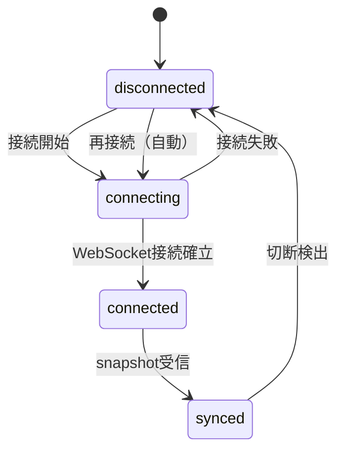

# 13 - UIクライアント

## 1. Godotプロジェクト構成

### 1.1 ディレクトリ構成

```
ui/
├── project.godot
├── scenes/
│   ├── main.tscn                # メインシーン
│   ├── connection_dialog.tscn   # 接続設定ダイアログ
│   └── components/
│       ├── map_view.tscn        # マップ描画コンポーネント
│       ├── agent_sprite.tscn    # エージェントスプライト
│       ├── speech_bubble.tscn   # 会話吹き出し
│       ├── agent_list.tscn      # エージェント一覧パネル
│       └── event_log.tscn       # イベントログパネル
├── scripts/
│   ├── main.gd
│   ├── connection/
│   │   ├── ws_client.gd         # WebSocketクライアント
│   │   └── reconnect.gd         # 再接続制御
│   ├── state/
│   │   ├── world_state.gd       # ワールド状態管理
│   │   ├── agent_state.gd       # エージェント状態
│   │   └── event_processor.gd   # イベント→状態変換
│   ├── view/
│   │   ├── map_renderer.gd      # マップ描画
│   │   ├── agent_controller.gd  # エージェント表示・アニメーション
│   │   ├── conversation_view.gd # 会話表示
│   │   └── server_event_fx.gd   # サーバーイベント演出
│   └── theme/
│       └── theme_manager.gd     # テーマ管理
├── themes/
│   └── default/
│       ├── theme.json
│       ├── tiles/
│       └── sprites/
└── resources/
```

### 1.2 シーンツリー

```
Main (Node2D)
├── WSClient (Node)                    # WebSocket通信
├── WorldState (Node)                  # 状態管理
├── Camera2D                           # パン・ズーム操作
├── MapView (Node2D)                   # マップ描画
│   ├── TileMapLayer                   # グリッドタイル
│   └── Labels (Node2D)               # ノードラベル
├── AgentContainer (Node2D)            # エージェントスプライト群
│   ├── AgentSprite (per agent)
│   └── ...
├── OverlayContainer (Node2D)          # 会話吹き出し等のオーバーレイ
├── UI (CanvasLayer)                   # UIパネル
│   ├── ConnectionBar (HBoxContainer)  # 接続先・テーマ選択
│   ├── SidePanel (VBoxContainer)      # サイドパネル
│   │   ├── AgentList                  # エージェント一覧
│   │   └── EventLog                   # イベントログ
│   └── StatusBar (HBoxContainer)      # ステータスバー
└── ConnectionDialog (Window)          # 接続設定ダイアログ
```

## 2. 通信層

### 2.1 WebSocketクライアント

GodotのWebSocketPeerを使用してサーバーに接続する。管理者認証（`X-Admin-Key` ヘッダー）が必要。

```
接続URL: ws://{host}:{port}/ws
ヘッダー: X-Admin-Key: {admin_key}
```

#### 接続状態

| 状態 | 説明 |
|------|------|
| disconnected | 未接続 |
| connecting | 接続試行中 |
| connected | 接続済み（スナップショット受信待ち） |
| synced | 同期完了（イベント受信中） |

#### 状態遷移



### 2.2 メッセージ処理

WebSocketで受信するメッセージは以下の2種類（03-world-engine.md セクション7）:

```
{ "type": "snapshot", "data": WorldSnapshot }
{ "type": "event",    "data": WorldEvent }
```

| メッセージ | 処理 |
|-----------|------|
| `snapshot` | 状態管理層に全置換を指示 → 再描画 |
| `event` | 状態管理層にイベント適用を指示 → 差分描画 |

### 2.3 再接続

WebSocket切断時、自動再接続を試行する。

| パラメータ | 値 |
|-----------|-----|
| 初回待機 | 1秒 |
| 最大待機 | 30秒 |
| バックオフ | 指数バックオフ（×2） |
| 最大試行回数 | 無制限 |

再接続フロー:

1. 切断を検出
2. UI上に「接続中...」を表示
3. 待機時間後に再接続を試行
4. 接続成功 → スナップショットを受信して状態を全置換
5. 接続失敗 → 待機時間を倍にして再試行

## 3. 状態管理層

### 3.1 ワールド状態

通信層から受け取ったデータを保持し、プレゼンテーション層に提供する。

```
WorldState
├── world: WorldData         # ワールドメタデータ（スナップショットから不変）
│   ├── name
│   └── description
├── map: MapConfig           # マップ構造（スナップショットから不変、01-data-model.md §1.1）
│   ├── rows, cols, nodes, buildings, npcs
├── agents: { AgentId → AgentData }
│   ├── agent_name
│   ├── node_id
│   ├── state: idle | moving | in_action | in_conversation
│   └── movement?: { from_node_id, to_node_id, path, arrives_at }
├── conversations: { ConversationId → ConversationData }
│   ├── status: pending | active | closing
│   ├── initiator_agent_id
│   ├── target_agent_id
│   ├── current_turn
│   ├── current_speaker_agent_id
│   ├── closing_reason?
│   └── messages: { speaker, text }[]  # 表示用バッファ（初回発言含む、UIローカル管理）
└── server_events: { ServerEventId → ServerEventData }
    ├── event_id              # 定義ID（テーマのエフェクトマッピング用）
    ├── name, description
    ├── choices
    ├── delivered_agent_ids
    └── pending_agent_ids
```

スナップショットに含まれない情報（会話メッセージ履歴、アクション詳細等）はUIがイベント受信時にローカルで管理する。再接続時にはこれらの情報はクリアされる（セクション3.2参照）。

### 3.2 スナップショット適用

`snapshot` メッセージ受信時、ワールド状態を全置換する。

処理:

1. マップ（`MapConfig` 全体）・ワールドメタデータを設定
2. エージェント状態を `AgentSnapshot[]` から構築
3. 会話状態を `ConversationSnapshot[]` から構築
4. サーバーイベント状態を `ServerEventSnapshot[]` から構築（エフェクトマッピング用に `event_id` をキャッシュ）
5. プレゼンテーション層に全再描画を通知
6. `moving` 状態のエージェントについて、`movement.path` と `movement.arrives_at` から移動アニメーションを再構築（セクション5.4参照）

#### 再接続時の表示制約

スナップショットによる再同期では以下の情報は復元されない:

- 会話の過去の発言内容（`ConversationSnapshot` にメッセージ履歴は含まれない）
- イベントログの過去エントリ（再接続前に受信したイベント）
- サーバーイベントの演出表示

再接続時はこれらの表示をクリアし、以降のイベントから再構築する。

### 3.3 イベント適用

`event` メッセージ受信時、イベント種別に応じて状態を差分更新する。

| イベント | 状態更新 |
|---------|---------|
| `agent_joined` | エージェントを追加（node_id, state: idle） |
| `agent_left` | エージェントを削除 |
| `movement_started` | エージェントのstate → moving、path・arrives_atを設定 |
| `movement_completed` | エージェントのnode_id更新、state → idle、movement情報クリア |
| `action_started` | エージェントのstate → in_action、action情報を設定 |
| `action_completed` | エージェントのstate → idle、action情報クリア |
| `wait_started` | エージェントのstate → in_action |
| `wait_completed` | エージェントのstate → idle |
| `conversation_requested` | 会話をpending状態で追加（`message` を最初のメッセージとして保持） |
| `conversation_accepted` | 両エージェントのstate → in_conversation、会話のstatus → active。受諾側が `in_action` だった場合はアクション情報をクリア |
| `conversation_rejected` | 会話を削除、発信側のstate → idle |
| `conversation_message` | 会話にメッセージを追加、`current_turn` と `current_speaker_agent_id` を更新（turn 2 以降。初回発言は `conversation_requested` で処理済み） |
| `conversation_ended` | 会話を削除、両エージェントのstate → idle |
| `server_event_fired` | サーバーイベントを記録（`event_id_ref`, `choices` をキャッシュ） |
| `server_event_selected` | エージェントの選択を記録。`source_state` が `in_action` の場合はエージェントのstate → idle |

## 4. マップ描画

### 4.1 グリッド座標系

サーバーのノードID `{row}-{col}` をGodotの2D座標に変換する。

```
タイルサイズ: TILE_SIZE × TILE_SIZE ピクセル（テーマで定義）

ノード "r-c" の描画位置:
  x = (c - 1) × TILE_SIZE
  y = (r - 1) × TILE_SIZE
```

原点（1-1）は画面左上とする。

### 4.2 TileMapLayerの使用

GodotのTileMapLayerノードを使用してグリッドを描画する。

| TileSet設定 | 値 |
|------------|-----|
| タイルサイズ | テーマ依存（例: 64×64, 32×32） |
| ソースタイプ | Atlas（タイルシート） |
| カスタムデータ | なし（描画専用） |

タイルIDとノード種別の対応:

| ノード種別 | タイルID | 説明 |
|-----------|---------|------|
| `normal` | 0 | 通常地面 |
| `wall` | 1 | 壁 |
| `door` | 2 | ドア |
| `building_interior` | 3 | 建物内部 |
| `npc` | 4 | NPCノード |
| 未定義ノード | 0 | `normal`と同じ |

### 4.3 スナップショットからの描画

`WorldSnapshot` 受信時のマップ描画手順（`WorldSnapshot.map` は `MapConfig` 全体を含む）:

1. TileMapLayerをクリア
2. `map.rows × map.cols` のグリッド全体を `normal`（タイルID 0）で埋める
3. `map.nodes` の各エントリに対し、種別に対応するタイルIDを設定
4. `map.buildings` の建物名、`map.npcs` のNPC名のラベルを `Labels` ノードに追加

### 4.4 ラベル表示

ノードに `label` がある場合、タイルの上にテキストラベルを表示する。

| 対象 | 表示内容 |
|------|---------|
| label付きノード | ノードのlabel |
| 建物のドア | 建物名 |
| NPCノード | NPC名 |

### 4.5 カメラ操作

| 操作 | 入力 |
|------|------|
| パン（移動） | マウスドラッグ / 矢印キー |
| ズーム | マウスホイール / ピンチ（モバイル） |
| リセット | ホームキー / ダブルクリック |

## 5. エージェント表示

### 5.1 エージェントスプライト

各エージェントは `AgentSprite` シーンのインスタンスとして描画する。

```
AgentSprite (Node2D)
├── Sprite2D          # エージェントの画像
├── NameLabel (Label) # エージェント名
└── StateIcon (Sprite2D) # 状態アイコン（オプション）
```

エージェントの位置はノードIDからピクセル座標に変換して配置する（セクション4.1の座標系）。タイルの中央に配置する。

同一ノードに複数のエージェントがいる場合は、オフセットをつけて重なりを回避する。

### 5.2 状態表示

エージェントの現在状態をアイコンまたは色で表現する。

| 状態 | 表現 |
|------|------|
| idle | 通常表示 |
| moving | 移動アニメーション中 |
| in_action | アクションアイコン表示（歯車等） |
| in_conversation | 会話アイコン表示（吹き出し等） |

### 5.3 移動アニメーション

`movement_started` イベント受信時、エージェントを出発地点から目的地まで経路に沿って移動させる。

入力データ:

```
from_node_id: 出発ノード
to_node_id: 目的地ノード
path: NodeId[]  # 経路（fromを含まず、toを含む）
arrives_at: number  # 到着予定時刻（Unix timestamp ms）
```

アニメーション処理:

1. `arrives_at` から残り時間を算出
2. `path` の各ノードを中間地点として Tween でスムーズに移動
3. 各区間の時間 = 残り時間 / path.length
4. 最終地点に到着したらアニメーション完了

`movement_completed` イベントで最終位置を確定する（アニメーションのずれを補正）。

### 5.4 スナップショットからの移動アニメーション復元

スナップショット適用時、`moving` 状態のエージェントは `AgentSnapshot.movement` の情報からアニメーションを再構築する。

復元処理:

1. `movement.arrives_at` と現在時刻から残り時間を算出
2. `movement.path` から現在の推定位置を補間（04-movement.md セクション4.1 の算出方法に準拠）
3. 推定位置から目的地までの残り経路で Tween アニメーションを開始

残り時間が0以下（到着予定時刻を過ぎている）の場合は、目的地に即座に配置する。`movement_completed` イベントの受信で最終位置が確定する。

### 5.5 出現・消去

| イベント | アニメーション |
|---------|-------------|
| `agent_joined` | フェードインでスポーン地点に出現 |
| `agent_left` | フェードアウトで消去 |

## 6. 会話表示

### 6.1 会話の可視化

会話中のエージェント間を視覚的に接続し、発言内容を吹き出しで表示する。

```
 ┌─────────┐
 │ こんにちは │
 └────┬────┘
      │
   [Alice] ---- [Bob]
                  │
            ┌────┴────┐
            │ やあ！    │
            └─────────┘
```

### 6.2 吹き出し仕様

| 項目 | 仕様 |
|------|------|
| 表示位置 | 発言者スプライトの上方 |
| 表示時間 | 次の発言まで、または会話終了まで |
| 最大文字数 | テーマ設定による（超過時は省略表示） |
| 複数会話 | 会話ごとに独立して表示 |

### 6.3 イベントと表示の対応

| イベント | 会話表示の動作 |
|---------|-------------|
| `conversation_requested` | 発信側の吹き出しに初回発言（`message`）を表示、ターゲット側に受信アイコン表示 |
| `conversation_accepted` | 両者間に接続線を描画 |
| `conversation_rejected` | 吹き出し・受信アイコンを解除 |
| `conversation_message` | 発言者の吹き出しにメッセージを表示（turn 2 以降） |
| `conversation_ended` | 接続線・吹き出しを解除 |

## 7. サーバーイベント演出

### 7.1 イベント通知表示

`server_event_fired` 受信時、画面上に演出を表示する。

| 要素 | 説明 |
|------|------|
| バナー | 画面上部にイベント名・説明を表示 |
| エフェクト | テーマ定義のエフェクトがあれば再生 |
| 表示時間 | 数秒後にフェードアウト |

### 7.2 選択表示

`server_event_selected` 受信時、エージェントが選択した行動をエージェントスプライト付近にテキスト表示する。

## 8. UIパネル

### 8.1 エージェント一覧

サイドパネル上部に参加中エージェントの一覧を表示する。

| 列 | 内容 |
|----|------|
| 名前 | エージェント名 |
| 状態 | idle / moving / in_action / in_conversation |
| 位置 | 現在のノードID |

一覧のエージェントをクリックすると、カメラがそのエージェントの位置に移動する。

### 8.2 イベントログ

サイドパネル下部にイベントの時系列ログを表示する。

| 情報 | 内容 |
|------|------|
| 時刻 | イベントの `occurred_at` |
| 内容 | イベント種別に応じた要約テキスト |

最新のイベントが上に表示される。表示件数の上限を設ける（例: 100件）。

### 8.3 ステータスバー

画面下部にワールドの全体情報を表示する。

| 項目 | 内容 |
|------|------|
| 接続状態 | disconnected / connecting / synced |
| ワールド名 | `WorldConfig.name` |
| エージェント数 | 参加中のエージェント数 |

## 9. テーマシステム

### 9.1 テーマディレクトリ構成

```
themes/
├── default/
│   ├── theme.json
│   ├── tiles/
│   │   └── tileset.png     # タイルシート（5種別分）
│   ├── sprites/
│   │   └── agent.png       # エージェントスプライト
│   └── effects/            # エフェクト素材（オプション）
└── steampunk/
    ├── theme.json
    ├── tiles/
    │   └── tileset.png
    ├── sprites/
    │   └── agent.png
    └── effects/
        └── rain.tscn       # パーティクル等
```

### 9.2 テーマ定義ファイル

```json
{
  "name": "Default",
  "tile_size": 64,
  "tileset": "tiles/tileset.png",
  "tile_mapping": {
    "normal": { "atlas_x": 0, "atlas_y": 0 },
    "wall": { "atlas_x": 1, "atlas_y": 0 },
    "door": { "atlas_x": 2, "atlas_y": 0 },
    "building_interior": { "atlas_x": 3, "atlas_y": 0 },
    "npc": { "atlas_x": 4, "atlas_y": 0 }
  },
  "agent_sprite": "sprites/agent.png",
  "speech_bubble": {
    "max_chars": 50,
    "bg_color": "#FFFFFF",
    "text_color": "#000000"
  },
  "effects": {
    "sudden-rain": "effects/rain.tscn"
  }
}
```

### 9.3 テーマの切り替え

UIのテーマ選択ドロップダウンで切り替える。

切り替え時の処理:

1. 新しいテーマの `theme.json` を読み込み
2. TileMapLayerのTileSetを新テーマのタイルシートで再構築
3. エージェントスプライトを差し替え
4. エフェクト定義を更新
5. マップを再描画

### 9.4 エフェクトとサーバーイベントの対応

テーマの `effects` フィールドで、サーバーイベントの定義ID（`ServerEventConfig.event_id`）に対応するエフェクトシーンを定義できる。`server_event_fired` 受信時、定義IDに一致するエフェクトがあれば再生する。

対応するエフェクトがない場合はバナー表示のみ（セクション7.1）。

`ServerEventFiredEvent` には定義ID（`event_id_ref`）と選択肢一覧（`choices`）が含まれる（03-world-engine.md セクション2.2参照）。UIは `event_id_ref` でテーマのエフェクトマッピングを引く。`ServerEventSelectedEvent` には `choice_label` が含まれるため、選択表示にはそのまま使用できる。

## 10. 入力操作

### 10.1 デスクトップ操作

| 操作 | 入力 |
|------|------|
| パン | マウス中ボタンドラッグ / 矢印キー |
| ズーム | マウスホイール |
| エージェント選択 | 左クリック |
| カメラリセット | Home キー |
| 接続/切断 | UI ボタン |

### 10.2 モバイル操作（将来対応）

| 操作 | 入力 |
|------|------|
| パン | 1本指ドラッグ |
| ズーム | ピンチイン/アウト |
| エージェント選択 | タップ |
