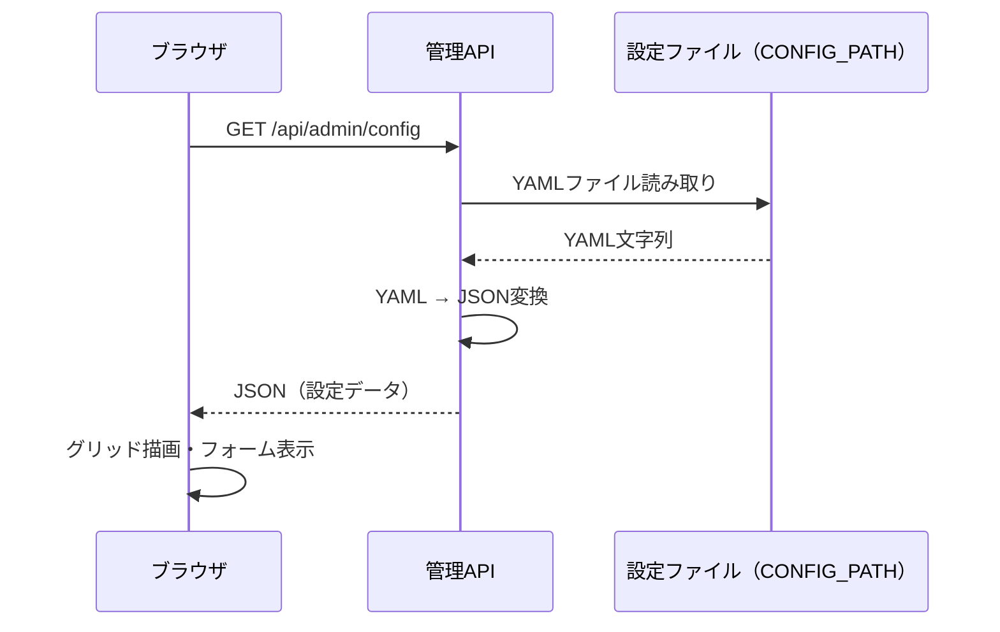
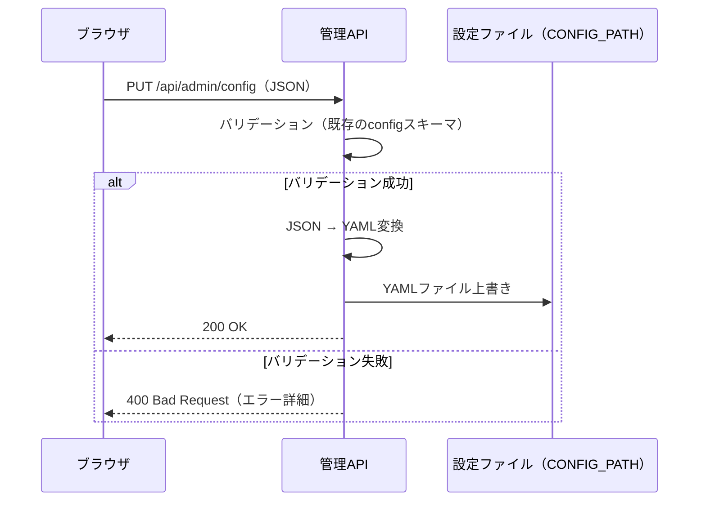

# Karakuri World - マップエディタ概要設計

> **注意**: 本ドキュメントは概要設計であり、記載されている仕様・構成等はすべて概念レベルのものである。実装時には詳細を改めて検討すること。

## 1. 概要

本ドキュメントでは、Karakuri Worldの**マップエディタ**の設計を定義する。
マップエディタはワールドサーバーに内蔵されるWeb UIであり、サーバーの設定ファイル（YAML）を**視覚的に編集**する機能を提供する。

### 1.1 設計方針

- ワールドサーバーと**同一プロセス**で動作するWeb UIとして提供する
- 編集対象はサーバーの**設定ファイル（YAML）そのもの**であり、独自のデータストアは持たない
- グリッドマップを**視覚的に**編集できるようにし、YAML手書きの困難さを解消する
- 管理API（`X-Admin-Key`）で保護する（Web UIの静的ファイル配信自体は認証不要）

### 1.2 解決する問題

設定YAMLの手書きには以下の問題がある:

- グリッドが大きくなるとノードの位置関係を把握できない
- 建物の壁・ドア・内部の配置ミスに気づきにくい
- NPC配置やアクション定義の整合性を目視で確認しづらい
- バリデーションエラーがサーバー起動時まで検出されない

マップエディタはこれらを視覚的な編集とリアルタイムバリデーションで解決する。

## 2. アーキテクチャ

### 2.1 全体構成

```
┌─────────────────────────────────────────────────────┐
│            Karakuri World Server                     │
│                                                       │
│  ┌───────────┐  ┌───────────┐  ┌──────────────────┐ │
│  │ World     │  │ REST API  │  │ Map Editor       │ │
│  │ Engine    │  │ MCP       │  │ Web UI           │ │
│  │           │  │ Discord   │  │ (静的ファイル配信) │ │
│  └───────────┘  └───────────┘  └──────────────────┘ │
│                       ↑               ↑              │
│                       │          管理API拡張          │
│                       │     (設定の読取・更新)        │
│                       ↓               ↓              │
│                 設定ファイル（CONFIG_PATH）                     │
└─────────────────────────────────────────────────────┘
         ↑                         ↑
    エージェント               ブラウザ（管理者）
```

### 2.2 コンポーネント構成

| コンポーネント | 役割 |
|-------------|------|
| 管理API拡張 | 設定YAMLの読み取り・バリデーション・更新のAPIエンドポイント |
| Web UI | ブラウザ上で動作するマップ編集画面（静的HTML/CSS/JS） |
| 設定ファイル | `CONFIG_PATH` で指定されるYAMLファイル（既存の設定ファイル） |

## 3. 機能概要

### 3.1 マップ編集

| 機能 | 説明 |
|------|------|
| グリッド表示 | 現在のマップをグリッドとして視覚表示 |
| グリッドサイズ変更 | 行数・列数の変更 |
| ノード種別配置 | タイルパレットからノード種別（normal, wall, door, building_interior, npc）を選択して配置 |
| ラベル編集 | ノードにラベル（表示名）を設定 |

### 3.2 建物編集

| 機能 | 説明 |
|------|------|
| 建物定義 | 壁・ドア・内部ノードをグループ化して建物を定義 |
| 建物メタデータ | 建物名・説明の編集 |
| 建物アクション | 建物に紐づくアクションの追加・編集・削除 |
| 整合性チェック | 建物トポロジ制約のリアルタイム検証（01-data-model.md セクション3.2） |

### 3.3 NPC編集

| 機能 | 説明 |
|------|------|
| NPC配置 | NPCノードにNPCを定義 |
| NPCメタデータ | NPC名・説明の編集 |
| NPCアクション | NPCに紐づくアクションの追加・編集・削除 |

### 3.4 ワールド設定編集

| 機能 | 説明 |
|------|------|
| 世界観設定 | 世界名・説明・スキル名の編集 |
| 移動設定 | 1ノードあたりの移動所要時間 |
| 会話設定 | 最大ターン数・インターバル・タイムアウト |
| 知覚範囲 | 知覚範囲のノード数 |
| スポーン地点 | スポーンノードの設定 |
| idle再通知 | 再通知間隔の設定 |

### 3.5 保存

| 機能 | 説明 |
|------|------|
| バリデーション | 保存前に設定全体のバリデーションを実行 |
| YAML更新 | バリデーション通過後、設定ファイルを上書き更新 |

## 4. データフロー

### 4.1 設定の読み取り



### 4.2 設定の更新



## 5. サーバーへの反映

### 5.1 設定反映の方針

マップエディタで保存した設定は**設定ファイルの更新のみ**を行う。稼働中のワールドエンジンへの即時反映は行わない。

| 操作 | 動作 |
|------|------|
| 保存 | 設定ファイル（YAML）を上書き |
| ワールドへの反映 | サーバー再起動が必要 |

### 5.2 理由

- 稼働中のワールドにはエージェントがログインしている可能性がある
- マップ構造の変更（ノード追加・削除）はエージェントの位置整合性に影響する
- 安全な反映のためには、エージェントのログアウト→設定更新→再ログインのフローが必要であり、これはサーバー再起動と等価である

## 6. 将来の拡張

| 拡張 | 説明 |
|------|------|
| モバイル管理アプリ | Web UIと同じ管理APIを使用するモバイルアプリの開発 |
| ホットリロード | エージェント不在時の設定ホットリロード対応 |
| 設定履歴 | 設定ファイルの変更履歴管理 |
| プレビュー | 編集中の設定でワールドをプレビュー |
