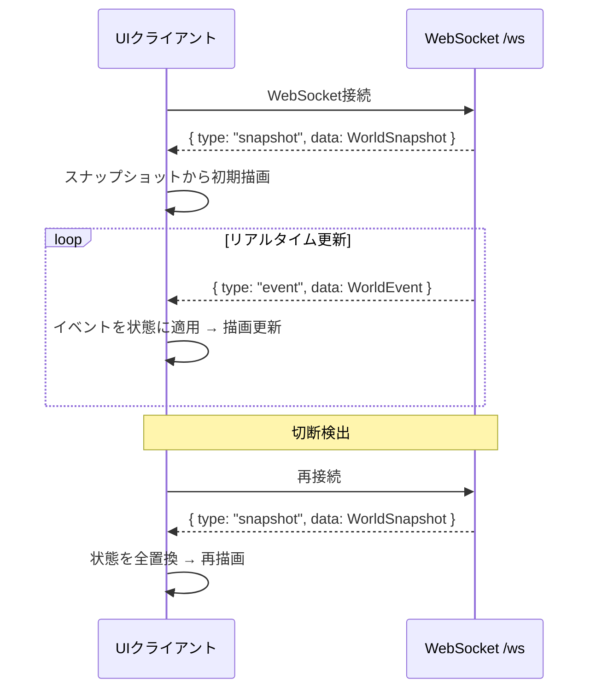

# Karakuri World - UIクライアント概要設計

> **注意**: 本ドキュメントは概要設計であり、記載されている仕様・構成等はすべて概念レベルのものである。実装時には詳細を改めて検討すること。

## 1. 概要

本ドキュメントでは、Karakuri Worldの**UIクライアント**の設計を定義する。
UIクライアントは稼働中のKarakuri Worldサーバーに接続し、ワールドの状態を**リアルタイムに可視化**する観戦用アプリケーションである。

ワールドサーバーとは**別プロセス**として起動し、サーバー側への変更は行わない。

### 1.1 設計方針

- UIクライアントは**読み取り専用**の観戦ビューアとする（ワールドへの操作は行わない）
- サーバーの既存エンドポイント（`GET /api/snapshot`、`WS /ws`）のみを使用する
- 初期実装は**Godot 4.x**で構築し、デスクトップ向けにリリースする
- サーバーごとに異なる見た目を実現する**テーマシステム**を備える
- 将来的にモバイル対応を視野に入れる

### 1.2 スコープ

| 含まれるもの | 含まれないもの |
|------------|-------------|
| マップのリアルタイム描画 | ワールド操作（移動・アクション等） |
| エージェントの状態表示・アニメーション | エージェント管理 |
| 会話・サーバーイベントの可視化 | マップ編集（サーバー側の機能） |
| テーマによる見た目の切替 | サーバー設定の変更 |

## 2. アーキテクチャ

### 2.1 全体構成

```
┌──────────────────────────────────────────────┐
│          UIクライアント（Godot 4.x）           │
│                                                │
│  ┌────────────────────────────────────────┐   │
│  │         プレゼンテーション層              │   │
│  │  マップ描画 / エージェント表示 /          │   │
│  │  会話吹き出し / イベント演出              │   │
│  └────────────────────────────────────────┘   │
│                     ↑                          │
│  ┌────────────────────────────────────────┐   │
│  │           状態管理層                     │   │
│  │  スナップショット保持 / イベント適用 /    │   │
│  │  エージェント状態 / 会話状態              │   │
│  └────────────────────────────────────────┘   │
│                     ↑                          │
│  ┌────────────────────────────────────────┐   │
│  │           通信層                         │   │
│  │  WebSocket接続 / イベント受信 /          │   │
│  │  再接続制御                              │   │
│  └────────────────────────────────────────┘   │
│                     ↑                          │
│  ┌────────────────────────────────────────┐   │
│  │           テーマ層                       │   │
│  │  タイルアセット / スプライト /            │   │
│  │  アニメーション定義 / エフェクト          │   │
│  └────────────────────────────────────────┘   │
└──────────────────────────────────────────────┘
                      ↑
                 WS /ws（リアルタイム）
                 GET /api/snapshot（フォールバック）
                      ↑
┌──────────────────────────────────────────────┐
│         Karakuri World Server                 │
└──────────────────────────────────────────────┘
```

### 2.2 層の責務

| 層 | 責務 |
|----|------|
| 通信層 | サーバーとのWebSocket接続、データ受信、再接続制御 |
| 状態管理層 | スナップショットの保持、イベント差分の適用、状態の正規化 |
| プレゼンテーション層 | 状態に基づいた描画・アニメーション・UI表示 |
| テーマ層 | ノード種別やエンティティに対応するアセットの提供 |

## 3. サーバーとの通信

### 3.1 使用するエンドポイント

| エンドポイント | 認証 | 用途 |
|--------------|------|------|
| `WS /ws` | Admin（`X-Admin-Key` ヘッダー） | リアルタイムイベント受信（接続時にスナップショットも受信） |
| `GET /api/snapshot` | Admin（`X-Admin-Key` ヘッダー） | フォールバック用の初期スナップショット取得 |

両エンドポイントは管理者認証で保護する（08-rest-api.md セクション7）。

### 3.2 同期モデル

サーバーの既存UI同期モデル（03-world-engine.md セクション7）に従う。



### 3.3 処理するイベント

WebSocketから受信するイベントと、UIでの表現:

| イベント | UI表現 |
|---------|--------|
| `agent_joined` | エージェントをスポーン地点に出現 |
| `agent_left` | エージェントをマップから消去 |
| `movement_started` | 経路に沿った移動アニメーション開始 |
| `movement_completed` | エージェントを目的地に配置 |
| `action_started` | アクション実行中の表示（アイコン・テキスト） |
| `action_completed` | アクション表示を解除 |
| `wait_started` | 待機中の表示 |
| `wait_completed` | 待機表示を解除 |
| `conversation_requested` | 会話リクエスト表示 |
| `conversation_accepted` | 会話中の接続表示 |
| `conversation_rejected` | リクエスト表示を解除 |
| `conversation_message` | 吹き出しにメッセージ表示 |
| `conversation_ended` | 会話表示を解除 |
| `server_event_fired` | 画面全体への演出表示 |
| `server_event_selected` | エージェントの選択を表示 |

## 4. 画面構成

### 4.1 メイン画面

```
┌──────────────────────────────────────────────────────┐
│ [接続先: ws://localhost:3000]              [テーマ: ▼] │
├───────────────────────────────────┬───────────────────┤
│                                   │                   │
│                                   │  エージェント一覧  │
│                                   │  ┌─────────────┐ │
│                                   │  │ Alice [idle] │ │
│         マップビュー               │  │ Bob [moving] │ │
│                                   │  │ ...          │ │
│     （グリッド + エージェント       │  └─────────────┘ │
│      + 建物 + NPC）               │                   │
│                                   │  イベントログ      │
│                                   │  ┌─────────────┐ │
│                                   │  │ 14:30 Alice  │ │
│                                   │  │  → 3-2 移動  │ │
│                                   │  │ 14:31 Bob    │ │
│                                   │  │  アクション中 │ │
│                                   │  └─────────────┘ │
├───────────────────────────────────┴───────────────────┤
│ 接続中 | Karakuri World | エージェント: 3             │
└──────────────────────────────────────────────────────┘
```

### 4.2 画面要素

| 要素 | 説明 |
|------|------|
| 接続設定 | サーバーURL入力・接続状態表示 |
| テーマ選択 | テーマの切り替え |
| マップビュー | グリッドマップの描画。パン・ズーム対応 |
| エージェント一覧 | 参加中エージェントの名前・状態・位置 |
| イベントログ | 受信イベントの時系列表示 |
| ステータスバー | 接続状態・ワールド名・参加エージェント数 |

## 5. テーマシステム

### 5.1 目的

サーバーごとに異なる世界観（スチームパンク、和風、ファンタジー等）に合わせたビジュアルを提供する。テーマはUIクライアント側の設定であり、サーバーには影響しない。

### 5.2 テーマとサーバーデータの対応

テーマはノードの**種別（type）**に基づいてタイルの見た目を決定する。サーバーから受信するノード種別は固定（`normal`, `wall`, `door`, `building_interior`, `npc`）であるため、テーマはこの5種別に対応するアセットを用意すればよい。

```
サーバー: { type: "wall", label: "石壁" }
     ↓
テーマ:  wall → steampunk/tiles/wall.png  （スチームパンクテーマ）
         wall → japanese/tiles/wall.png    （和風テーマ）
```

### 5.3 テーマの構成要素

| アセット種別 | 説明 |
|------------|------|
| タイル画像 | ノード種別ごとの描画素材 |
| エージェントスプライト | エージェントの表示素材（状態ごとのバリエーション） |
| エフェクト | サーバーイベント等の演出素材 |
| UIスタイル | パネル・テキストの色・フォント |

## 6. マルチプラットフォーム

### 6.1 対象プラットフォーム

| プラットフォーム | 優先度 | 備考 |
|----------------|--------|------|
| デスクトップ（Windows / macOS / Linux） | 高 | 初期ターゲット |
| モバイル（iOS / Android） | 中 | 将来対応 |
| Web（ブラウザ） | 低 | 将来検討 |

### 6.2 技術選定

初期実装はGodot 4.xをターゲットとする。

| 要件 | Godotの対応 |
|------|-----------|
| 2Dグリッド描画 | TileMapLayerノード |
| WebSocket | `WebSocketPeer` クラス |
| HTTP | `HTTPRequest` ノード |
| アニメーション | `AnimationPlayer` / `Tween` |
| マルチプラットフォーム | デスクトップ・モバイル・Webエクスポート対応 |
| 言語 | GDScript |

モバイルクライアントをGodot以外の技術で構築する場合も、通信層・状態管理層の設計は共通仕様として流用できる。
