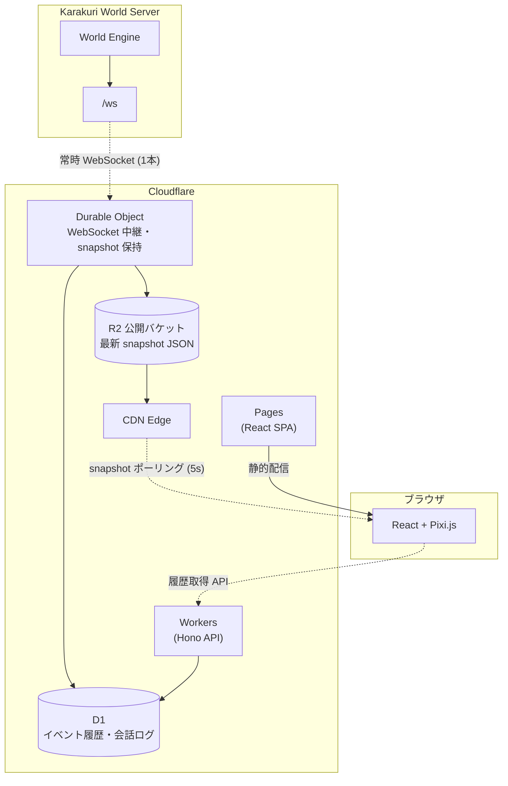

# Karakuri World - UIシステム概要設計

> **注意**: 本ドキュメントは概要設計であり、記載されている画面構成・アーキテクチャ・技術選定等はすべて概念レベルのものである。実装時には画面詳細、API 設計、認証方式、D1 スキーマ等を改めて検討すること。

## 1. 概要

本ドキュメントでは、Karakuri World の観戦用 UI（Web クライアント）の設計を定義する。
UI はワールドの状態を人間向けに可視化するための観戦ビューであり、エージェントの操作系機能は持たない（操作は Discord および REST/MCP に限定）。

### 1.1 設計方針

- **観戦専用**: UI からのワールド操作は行わず、読み取り専用ビューとする
- **本体サーバーの負荷最小化**: Karakuri World サーバーに対する WebSocket 接続は中継レイヤーから 1 本のみに抑える
- **シークレット非露出**: `ADMIN_KEY` 等は中継レイヤー側に閉じ込め、ブラウザには露出させない
- **CDN でのスケール**: UI クライアントへの配信はエッジキャッシュ経由のポーリングで行い、同時接続数に対する上限を持たせない
- **マップ描画はゲームエンジンベース**: 天気エフェクト・昼夜表現・移動アニメーション・アクション演出を含む描画要件を一貫して扱うため、2D ゲームエンジン（Pixi.js）で描画する
- **デスクトップ / モバイル両対応**: レイアウトを 2 系統用意し、モバイルはボトムシートで情報を切り替える

### 1.2 スコープ外

- エージェントの操作・チャット送信などの書き込み系機能
- 管理者向けの CRUD 系操作（管理は Discord `#world-admin` スラッシュコマンドに集約）
- UI 起点でのサーバーイベント発火

## 2. アーキテクチャ

### 2.1 全体構成

UI は Karakuri World サーバーとは別リポジトリ / 別ホスティングで構築し、Cloudflare スタックを中継レイヤーに用いる。



### 2.2 データフロー

1. Durable Object が Karakuri World の `/ws` に `X-Admin-Key` 認証付きで 1 本だけ常時接続する
2. 受信したイベントを D1 に蓄積しつつ、DO メモリ上の最新 snapshot を更新する。WebSocket で配信されないイベント（`idle_reminder_fired`、`map_info_requested`、`world_agents_info_requested`、`perception_requested`、`available_actions_requested`）は本体側で除外済みのため、D1 蓄積対象もこれに準じる（`conversation_requested` 等の会話系イベントは配信・蓄積の対象）
3. snapshot の更新は throttle（最大 1 回 / 5 秒）で R2 公開バケットに JSON ファイルとして書き出す。書き込み時に `Cache-Control: public, max-age=5` ヘッダーを付与する。Cloudflare CDN は JSON をデフォルトではキャッシュしないため、R2 公開バケットのカスタムドメインに対して Cache Rules で「Cache Everything」を設定する必要がある
4. UI クライアントは R2 公開バケットの CDN URL を 5 秒間隔でポーリングする。CDN エッジヒット時は R2 への読み取りも Worker の実行も発生しない
5. エージェント選択時などの履歴表示は UI から Workers の `/api/history` を叩き、Workers が D1 から取得して返す

エージェントの行動サイクルが 10 分単位であることを踏まえ、観戦 UI の鮮度要件は「数十秒以内」で十分である。本構成での最大可視遅延は「R2 書き込み間隔（5 秒）+ CDN TTL（5 秒）+ クライアントポーリング間隔（5 秒）」の合計で最大 15 秒程度となるが、10 分サイクルの世界では観戦体験上問題にならない。これら 3 つの間隔は連動して調整する設計制約がある。クライアント向けの WebSocket 配信は行わず、CDN ポーリングに一本化することで DO の fan-out 負荷と同時接続上限の問題を回避する。

### 2.3 Cloudflare サービス構成

| サービス | 役割 |
|----------|------|
| **Workers** | API エンドポイント（`/api/history` 等）・認証・ルーティング |
| **Durable Objects** | Karakuri World との WebSocket 常時接続・snapshot 保持・D1 書き込み・R2 更新 |
| **D1** | イベント履歴・会話ログの蓄積（SQLite） |
| **R2** | 最新 snapshot JSON の公開バケット配信（CDN キャッシュ経由） |
| **Pages** | React SPA の静的ホスティング |

### 2.4 コスト想定

Paid プラン前提（試算時点: 2026-04）で、100 エージェント規模まで基本料金の $5/月 にほぼ収まる見込み。ポーリング間隔を 5 秒と仮定した場合の試算である。

| 項目 | 内訳 | 月額 |
|------|------|------|
| Workers Paid 基本料金 | 固定 | $5.00 |
| DO Duration | 常時接続 1 本で約 324K GB-s / 月（= 約 10.8K GB-s / 日、無料枠 400K GB-s / 月内）。アウトバウンド WebSocket は Hibernation 対象外のため常時課金されるが、無料枠に収まる | $0 |
| DO Requests | WebSocket メッセージ 20 件 = 1 DO Request として換算。100 エージェント（~432K メッセージ / 月）でも ~21.6K DO Requests / 月で無料枠 1M 内 | $0 |
| Workers Requests | `/api/history` 等の動的 API 呼び出し分のみ。snapshot ポーリングは R2 公開バケット + CDN 経由のため Worker は実行されない | $0 |
| R2 Class A（書き込み） | 5 秒デバウンスで ~518K / 月（無料枠 1M / 月内） | $0 |
| R2 Class B（読み取り） | Cache Rules で JSON を CDN キャッシュ対象に設定（Edge TTL 5 秒）。エッジヒット時は R2 に到達しない。無料枠 10M / 月 | $0 |
| D1 Writes | イベント蓄積、無料枠 50M / 月に対して事実上無視可 | $0 |
| **合計** | | **$5 / 月** |

料金改定時は再計算が必要。500 エージェント規模（~7.5M メッセージ / 月 → ~375K DO Requests / 月）でも無料枠内に収まる。

### 2.5 スケーラビリティ

- **本体サーバー負荷**: UI クライアント数に関わらず Karakuri World へは WebSocket 1 本のみ
- **同時閲覧数**: snapshot は R2 公開バケット + CDN グローバルキャッシュで配信されるため、同時閲覧者数に上限がない。CDN エッジヒット時は R2 読み取りも Worker 実行も発生しない
- **バズ耐性**: Cache Rules で snapshot JSON の Edge TTL を 5 秒に設定することでエッジヒット率が非常に高くなり、閲覧者の増加がバックエンドのコスト・負荷にほぼ影響しない
- **snapshot 更新戦略**: DO は個々のイベントから snapshot を差分更新するのではなく、イベント受信をトリガーとして本体の `/api/snapshot` から最新の `WorldSnapshot` を再取得し、`SpectatorSnapshot` に変換して R2 に書き出す。これによりドメインロジックの DO 側への移植が不要になる
- **障害時の挙動**: DO 再起動時は Karakuri World の `/ws` に再接続する。接続確立時に本体から `type: 'snapshot'` ペイロードが 1 回送信されるため、DO はそれでインメモリ状態を再構築する。再接続中は R2 上の snapshot が一時的に古くなるため、UI 側で `generated_at` を用いた stale 検知表示を行う。再接続ロジック（指数バックオフ等）の詳細は詳細設計で定義する

### 2.6 認証方針（未決事項）

UI は観戦専用で書き込み系を持たないため、以下の候補から運用ポリシーに応じて選定する。snapshot は R2 公開バケットから CDN 経由で直接配信されるため、Worker を経由しないパスでも認証が効く方式に限定される。

- **Cloudflare Access** による認可（R2 カスタムドメインにも適用可能）
- **無認証**（公開ビューとして運用。§6.3 の `SpectatorSnapshot` により内部情報は除外済み）

## 3. 画面構成

### 3.1 デスクトップレイアウト

```
┌──────────────┬────────────────────────────┐
│ [サイドバー]  │        [マップ]             │
│              │                            │
│ 📅 春・3日目  │    ┌──┬──┬──┬──┐           │
│ 🌤 晴れ 18℃  │    │  │💬│  │  │           │
│              │    │  │🐰│  │  │           │
│ ── イベント ──│    ├──┼──┼──┼──┤           │
│ 📢 収穫祭開始 │    │  │  │💤│  │           │
│              │    │  │  │🐱│  │           │
│ ── エージェント│    ├──┼──┼──┼──┤           │
│ (スクロール↕) │    │🌾│  │  │②│           │
│ 🐰 Alice 💬  │    │🐸│  │  │👥│           │
│ 🐱 Bob   💤  │    └──┴──┴──┴──┘           │
│ 🐸 Carl  🌾  │                     ┌──────┤
│ 🐶 Dave  💤  │                     │ オー  │
│              │                     │ バー  │
│              │                     │ レイ  │
└──────────────┴─────────────────────┴──────┘
```

- 左: 固定幅サイドバー
- 中央: マップビュー（可変サイズ）
- 右: エージェント詳細オーバーレイ（選択時のみ右側からスライドイン）

### 3.2 モバイルレイアウト

```
┌───────────────┐
│  マップ(全画面) │
│               │
│  📅春3日目 🌤 │  ← 上部バッジ（日付・天気）
│               │
│    💬         │
│    🐰    ②   │
│          👥   │
│               │
├───────────────┤
│ ☰ ボトムシート  │
│ ── イベント ── │
│ 📢 収穫祭開始  │
│ ── エージェント│
│ 🐰Alice 🐱Bob │
└───────────────┘
```

- マップはビューポート全面
- 日付・天気は上部バッジに格納
- サイドバー相当の情報はボトムシートで提供し、3 段階（最小化 / 一覧 / 詳細）でスワイプ切り替え

### 3.3 サイドバー構成

| 領域 | 内容 | スクロール |
|------|------|------------|
| 上部（固定） | 日付・季節・天気・気温 | 固定 |
| 中部（固定） | 直近のサーバーイベント | 固定 |
| 下部 | エージェント一覧 | スクロール可 |

### 3.4 オーバーレイ（エージェント詳細）

- **デスクトップ**: 右側スライドインパネル
- **モバイル**: ボトムシートを詳細モードに展開
- **表示内容**: 名前・状態・現在地・行動履歴（時系列降順、絵文字 + 概要）
- 会話ログはタップで展開可能とする

## 4. マップ

### 4.1 描画ルール

- 既存の `src/discord/map-renderer.ts` と同じ描画ルール（グリッド、建物色分け、ノードラベル）をブラウザ上で再現する
- グリッド・建物・ノードラベルを最下層、エージェントアイコンを上層レイヤーとして重ねる

### 4.2 ビューポート操作

- ピンチ / スクロールでズーム
- ドラッグでパン
- エージェント選択時はフォーカス移動 + ズームインのアニメーションを行う

### 4.3 エージェント表示

- エージェント登録時に Discord API から自動取得した `discord_bot_avatar_url` をスプライトとして配置する（未取得時は既定アイコンにフォールバック）
- 状態に応じた絵文字をアイコン上に重ねる（例: 💬 会話中 / 🚶 移動中 / 💤 待機中 / アクション種別ごとの絵文字）
- 同一ノードに 2 体以上いる場合はバッジ付きグループアイコンにまとめ、タップで展開する

### 4.4 操作フロー

- マップ上でエージェントを直接タップ、またはサイドバー / ボトムシートからエージェントを選択
- 選択するとマップがフォーカス移動 + ズームインし、オーバーレイに行動履歴が表示される

## 5. 技術選定

### 5.1 フロントエンド

| 技術 | 用途 |
|------|------|
| **React (Vite SPA)** | UI フレームワーク。エコシステム・AI 支援・長期拡充を考慮 |
| **Pixi.js v8** | マップ描画。2D 仮想世界ビューアに適した WebGL/WebGPU ベースエンジン |
| **@pixi/react** | React コンポーネントとして Pixi を扱う |
| **pixi-viewport** | マップのズーム・パン・ピンチ・フォーカス移動。`@pixi/react` v8 との統合に既知の問題があり（pixijs/pixi-react#590）、イベントシステムの受け渡し方法を詳細設計時に確認すること |
| **Tailwind CSS** | サイドバー・オーバーレイ等の DOM UI のスタイリング |
| **Zustand** | 状態管理（snapshot ポーリング状態・エージェント選択状態等） |

### 5.2 Workers バックエンド

| 技術 | 用途 |
|------|------|
| **Hono** | API ルーティング（本体サーバーと統一） |
| **Durable Objects** | Karakuri World との WebSocket 常時接続・snapshot 保持・D1 書き込み・R2 更新 |
| **D1** | イベント履歴・会話ログの蓄積 |
| **R2** | snapshot JSON の公開バケット配信 |

### 5.3 マップ描画に Pixi.js を選定する理由

マップ描画は天気エフェクト・昼夜表現・移動アニメーション・アクション演出を含む要件であり、本質的に 2D ゲーム画面と同等である。すべての描画要件を単一のエンジンで一貫して扱える。

| 要件 | Pixi.js での実現方法 |
|------|----------------------|
| グリッド・建物描画 | Graphics API |
| エージェントアイコン | Sprite（100 体超でも軽量） |
| 状態絵文字 | BitmapText / HTMLText |
| ズーム / パン / ピンチ | pixi-viewport |
| フォーカス移動 + ズームイン | `viewport.animate()` |
| タップ / クリック | Federated Events（`eventMode: 'static'`） |
| グループ化 / 展開 | Container |
| 天気エフェクト（雨・雪・霧） | ParticleContainer / Filter |
| 昼夜の明暗 | ColorMatrixFilter |
| 移動アニメーション | Ticker + 座標補間 |
| アクション演出 | AnimatedSprite / パーティクル |

### 5.4 プロジェクト構成（UI 側リポジトリ）

```
karakuri-world-ui/
├── app/                            # React SPA (Vite)
│   ├── components/
│   │   ├── map/
│   │   │   ├── MapCanvas.tsx       # @pixi/react の Application + Viewport
│   │   │   ├── GridLayer.tsx       # グリッド・建物・ノード描画
│   │   │   ├── AgentLayer.tsx      # エージェント Sprite 配置・更新
│   │   │   ├── AgentSprite.tsx     # 個別アイコン + 状態絵文字
│   │   │   ├── AgentGroup.tsx      # グループ化表示・展開
│   │   │   └── constants.ts        # セルサイズ・色パレット等
│   │   ├── sidebar/
│   │   │   ├── Sidebar.tsx
│   │   │   ├── EventList.tsx
│   │   │   └── AgentList.tsx
│   │   ├── overlay/
│   │   │   └── AgentOverlay.tsx    # エージェント行動履歴
│   │   └── mobile/
│   │       └── BottomSheet.tsx
│   ├── stores/                     # Zustand（snapshot・エージェント選択状態）
│   └── hooks/                      # useSnapshotPolling, useMapViewport 等
├── worker/                         # Cloudflare Workers + DO
│   ├── index.ts                    # Hono API
│   └── durable-object.ts           # WebSocket 中継 + R2 snapshot 更新 + D1 蓄積
├── wrangler.toml
└── vite.config.ts
```

Pixi 領域（マップ）と DOM 領域（サイドバー・オーバーレイ・ボトムシート）を分離し、UI パーツは React + Tailwind、マップのみ Pixi.js で描画する。

## 6. Karakuri World サーバー側に必要な対応

UI を成立させるために、本体サーバー側で以下の拡張が必要である。詳細は別途設計する。

### 6.1 天気情報の公開（既存機能）

天気・気温は既に `WorldSnapshot.weather`（`SnapshotWeather` 型）として snapshot に含まれている。UI はこの既存フィールドをそのまま利用する。

### 6.2 ワールド日付・季節の追加（新規機能）

現行の `ServerConfig` には `timezone` のみが存在し、ゲーム内日付・季節の概念はない。サイドバーの「春・3 日目」のような表示を実現するには、日付・季節モデルの**新規実装**が必要である。具体的なモデル定義は別途検討する。

### 6.3 観戦用スナップショット型の定義

現在の `WorldSnapshot` には `discord_channel_id`、`money`、`items` など観戦 UI には不要かつ公開に適さない内部情報が含まれている。認証の有無に関わらず、配布先がブラウザである以上「観戦クライアントに出してよい情報か」の観点で型を分離すべきである。DO 側で `WorldSnapshot` から `SpectatorSnapshot` に変換して R2 に書き出す構成とする。

`SpectatorSnapshot` には `discord_bot_avatar_url` を含め、`discord_channel_id` 等は除外する。これにより §6.4 のアバター URL 公開も `SpectatorSnapshot` の定義で一括して解決する。WebSocket イベントストリームで DO が受信するイベントにも `discord_channel_id` 等が含まれるため、D1 蓄積時にも同様のフィールド除去を行う。

### 6.4 エージェントアバター URL の取得経路

`discord_bot_avatar_url` は `agents.json`（永続化層）に保持されているが `AgentSnapshot` 型には含まれていない。DO が avatar URL を取得するには以下のいずれかの対応が必要である:

- 本体の `AgentSnapshot` に `discord_bot_avatar_url` フィールドを追加する（推奨。WebSocket / スナップショット経由で自然に伝搬する）
- DO が別途本体の管理 API からエージェント情報を取得する

前者の方針を採る場合、§6.3 の `SpectatorSnapshot` 変換時にそのまま利用できる。

### 6.5 エージェントアイコン（将来）

将来的には登録時に UI 用アイコン（画像 URL や絵文字）を明示的に指定できるようにする。

### 6.6 DO からの接続認証

DO は本体サーバーの `/ws` および `/api/snapshot` に接続するが、いずれも `X-Admin-Key` ヘッダーによる認証が必須である。DO の環境変数 Secrets に管理キーを保持し、WebSocket ハンドシェイク時にヘッダーとして付与する。ブラウザからの WebSocket 接続ではカスタムヘッダーを送れないが、DO はサーバーサイドからの接続であるためこの制約は該当しない。

## 7. 段階的な実装計画

### 7.1 初期実装

- グリッド・建物・ノードラベルの描画（Pixi.js Graphics API）
- エージェントアイコンの配置と状態絵文字の表示
- ズーム / パン / ピンチ操作
- サイドバー・ボトムシート・オーバーレイの UI

### 7.2 演出の追加

初期実装と同じ Pixi.js 基盤の上に段階的に追加する。描画エンジンの移行は発生しない。

- **天気演出**: 雨・雪・霧のパーティクル表示（`ParticleContainer`）
- **昼夜表現**: ワールド時刻に応じた `ColorMatrixFilter` による明暗。建物内部・ドア周辺に光源表現
- **移動アニメーション**: `MovementStartedEvent.path` と `arrives_at` を使って経路上の座標を `Ticker` で補間し、スムーズに移動表示
- **アクション演出**: アクション種別に応じた `AnimatedSprite` やパーティクル（釣り竿、湯気、💤 吹き出し等）

### 7.3 将来拡張

- **WebSocket 配信の追加**: ポーリングでは不十分なユースケース（会話吹き出しの即時表示等）が出てきた場合、DO から UI への WebSocket fan-out を追加する
- **連合サーバー対応**: 連合サーバー構成が実現した場合、他ワールドビューへのナビゲーションを UI 側で提供する
- **会話ログのリプレイ**: D1 に蓄積した会話履歴をタイムライン形式で再生

## 8. 未決事項

- [ ] UI 側の認証方式（Cloudflare Access / 無認証）
- [ ] `SpectatorSnapshot` の型定義（`WorldSnapshot` から除外するフィールド、D1 蓄積時のイベントサニタイズ対象）
- [ ] D1 スキーマ（蓄積対象の `WorldEvent` サブタイプ、取得軸 `agent_id + occurred_at` 等、ページング、保持期間）
- [ ] `/api/history` のクエリパラメータ定義（フィルタ・ページング・レスポンス形式）
- [ ] 最初に実装する画面の優先順位（マップ表示 / 会話ログ / エージェント一覧）
- [ ] エージェントアイコンの指定方法（Discord アバター流用のみで十分か、UI 独自設定を追加するか）
- [ ] アクション種別 → 絵文字マッピング（本体側 `ActionConfig` に `emoji` を追加するか、UI 側カタログで管理するか）
- [ ] snapshot 更新間隔の最終決定（R2 書き込み throttle・CDN TTL・クライアントポーリング間隔の 3 点を連動して調整。コスト試算は各 5 秒前提）
- [ ] ワールド日付・季節モデルの追加要否と定義
- [ ] マップ描画定数（色パレット・セルサイズ等）の本体側 `map-renderer.ts` との共有方法
