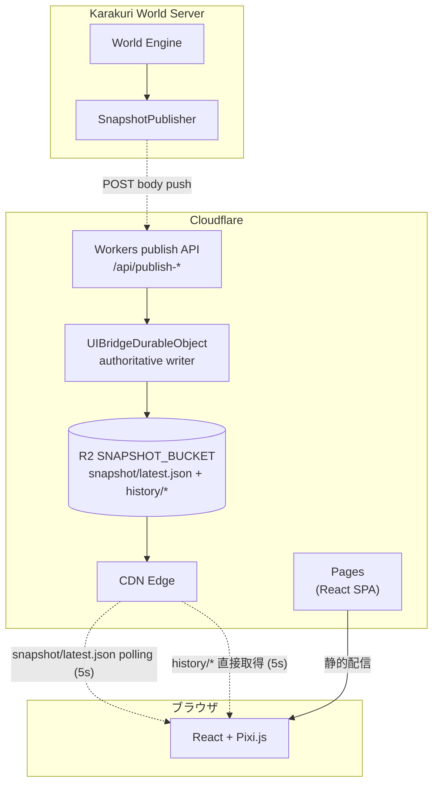

# Karakuri World - UIシステム概要設計

> **注意**: 本ドキュメントは概要設計であり、記載されている画面構成・アーキテクチャ・技術選定等はすべて概念レベルのものである。実装時には画面詳細、公開 snapshot / history 契約、認証方式等を改めて検討すること。
>
> **Issue #60 / #64 以降**: current-state UI の正本は **event-driven publish → R2 `snapshot/latest.json` と `history/*` を browser が 5 秒周期で直接 polling** である。relay `/ws` / D1 / manifest / versioned snapshot / Worker read endpoint はすべて撤廃済みで、観戦 UI は R2 CDN から静的 JSON を直接取得する。

## 1. 概要

本ドキュメントでは、Karakuri World の観戦用 UI（Web クライアント）の設計を定義する。
UI はワールドの状態を人間向けに可視化するためのビューであり、エージェントの操作系機能は持たない（操作は Discord および REST/MCP に限定）。

### 1.1 設計方針

- **観戦専用**: UI からのワールド操作は行わず、読み取り専用ビューとする
- **本体サーバーの負荷最小化**: current-state 配信は event-driven な snapshot / history publish を publisher 1 系統に集約し、ブラウザは CDN 配信された snapshot だけを読む
- **シークレット非露出**: `ADMIN_KEY` 等は publisher / Worker 側に閉じ込め、ブラウザには露出させない
- **CDN でのスケール**: UI クライアントへの配信はエッジキャッシュ経由のポーリングで行い、同時接続数に対する上限を持たせない
- **マップ描画はゲームエンジンベース**: 天気エフェクト・昼夜表現・移動アニメーション・アクション演出を含む描画要件を一貫して扱うため、2D ゲームエンジン（Pixi.js）で描画する
- **デスクトップ / モバイル両対応**: レイアウトを 2 系統用意し、モバイルはボトムシートで情報を切り替える

### 1.2 スコープ外

- エージェントの操作・チャット送信などの書き込み系機能
- 管理者向けの CRUD 系操作（管理は Discord `#world-admin` スラッシュコマンドに集約）
- UI 起点でのサーバーアナウンス発火

## 2. アーキテクチャ

### 2.1 全体構成

UI は同一 monorepo 内の `apps/front/` パッケージ（`@karakuri-world/front`）として構築し、Cloudflare スタックを snapshot publisher + history API の配信基盤として用いる。サーバー本体（`apps/server/`、`@karakuri-world/server`）とはパッケージ / デプロイ単位を分離し、本体リポジトリ部分へ UI 実装物を混在させない。



### 2.2 データフロー

1. backend が可視ステート変化イベントを起点に `WorldSnapshot` を組み立て、`POST /api/publish-snapshot`（snapshot を body に直接載せる）と `POST /api/publish-agent-history` を叩く
2. `UIBridgeDurableObject` は受け取った body をそのまま `applySnapshot` に流し `SpectatorSnapshot` へ変換、alias object `snapshot/latest.json` と `history/agents/{agent_id}.json` / `history/conversations/{conversation_id}.json` を R2 に publish する（`Cache-Control: public, max-age=5`）
3. UI クライアントは `snapshot/latest.json` を 5 秒周期で直接 polling する。edge は 5 秒 TTL でキャッシュするため、観戦者数が増えても R2 origin への GET は線形に増えない
4. エージェント / 会話選択時の履歴表示は同じ R2 origin から `history/agents/{agent_id}.json` / `history/conversations/{conversation_id}.json` を直接取得する。snapshot と同じ 5 秒周期で UI が polling し、100 件 cap 済みの静的 JSON をクライアント側でフィルタする
5. Worker には読み出し系 endpoint がなく、publish path (`/api/publish-snapshot` / `/api/publish-agent-history`) と DO 書き込みのみを担当する。コールドスタート時は永続化済みの `latest_snapshot` を復元し、startup 直後に 1 回 `requestPublish()` で初回 snapshot を R2 に書き込む

エージェントの行動サイクルが 10 分単位であることを踏まえ、観戦 UI の鮮度要件は「イベント発生後に最悪 10 秒程度で追随すること」で十分である（poll 周期 5 秒 + edge TTL 5 秒）。current-state の primary path は R2 alias を CDN 経由で直接読む構成で、クライアント向け WebSocket 配信は行わない。publish path は body push + R2 PUT retry で失敗耐性を確保する。

### 2.3 Cloudflare サービス構成

| サービス | 役割 |
|----------|------|
| **Workers** | publish endpoint（`/api/publish-snapshot` / `/api/publish-agent-history`）・認証・ルーティング（read 系 endpoint は持たない） |
| **UIBridgeDurableObject** | push された snapshot body を `applySnapshot` で取り込み、R2 publish retry、history serialize |
| **R2** | `snapshot/latest.json`（alias）と `history/agents/*` / `history/conversations/*` を `Cache-Control: public, max-age=5` で公開配信 |
| **Pages** | React SPA の静的ホスティング |

### 2.4 コスト想定

Paid プラン前提（試算時点: 2026-04）で、100 エージェント規模まで基本料金の $5/月 にほぼ収まる見込み。以下は **helper 無効の primary path 最小構成** を基準にした試算であり、追加の DO / helper worker を有効化する場合はその分のコストを別途上積みで見積もる。

| 項目 | 内訳 | 月額 |
|------|------|------|
| Workers Paid 基本料金 | 固定 | $5.00 |
| Workers Requests | publish endpoint 呼び出しのみ（イベント駆動）。current-state polling と history 取得はどちらも R2 公開バケット + CDN 経由で Worker を経由しない | $0〜 |
| R2 Class A（書き込み） | event-driven publish のため更新頻度依存。quiet period は push が来ない限り書き込みが発生しないため、100 エージェント規模でも無料枠 1M / 月内 | $0 |
| R2 Class B（読み取り） | `snapshot/latest.json` と `history/*` の読み取り。いずれも `max-age=5` で edge cache され、観戦者数に対して線形に増えない | $0 |
| Durable Object | authoritative writer / retry。launch 必須だが、Paid 基本料金内で吸収される前提 | $0 |
| **合計** | | **$5 / 月 + optional helper 分** |

料金改定時は再計算が必要。helper を無効化した最小構成では current-state path に追加の常時接続コストは乗らない。

### 2.5 スケーラビリティ

- **本体サーバー負荷**: UI クライアント数に関わらず current-state 配信の正本は backend からの event-driven publish request 1 系統のみ
- **同時閲覧数**: snapshot / history ともに R2 公開バケット + CDN グローバルキャッシュで配信されるため、同時閲覧者数に上限がない。どの object も `max-age=5` で edge cache され、origin hit は 5 秒に 1 回程度にフラット化される
- **バズ耐性**: UI は event-driven で更新される R2 alias と history object を直接 polling するため、閲覧者の増加がバックエンド / Worker invocation 数にほぼ影響しない
- **snapshot / history 更新戦略**: backend の `SnapshotPublisher` / `AgentHistoryManager` が可視ステート変化イベントごとに body push し、`UIBridgeDurableObject` が `SpectatorSnapshot` と history document を R2 に書き出す
- **障害時の挙動**: primary path は event-driven publish を前提とする。push 側は debounce + 指数バックオフ retry、DO 側は R2 PUT failure 時のみ alarm retry を行う。history 側も failure 時は backoff でリトライする。cold start 時は永続化済みの直前 snapshot を restore したうえで startup 直後の 1 回 publish で UI に最新状態を届ける。`/ws` には依存しない

### 2.6 認証方針（配備時に選択）

UI は観戦専用で書き込み系を持たないため、以下の 2 モードを配備ポリシーに応じて選択する。snapshot は R2 公開バケットから CDN 経由で直接配信されるため、Worker を経由しないパスでも認証が効く方式に限定される。成立条件の詳細は `docs/design/detailed/13-ui-relay-backend.md` §8 と `docs/design/detailed/15-ui-application-shell.md` §11 を参照。

- **Cloudflare Access** による認可（R2 カスタムドメインにも適用可能）
- **無認証**（公開ビューとして運用。§6.3 の `SpectatorSnapshot` により内部情報は除外済み）

## 3. 画面構成

### 3.1 デスクトップレイアウト

```
┌──────────────┬────────────────────────────┐
│ [サイドバー]  │        [マップ]             │
│              │                            │
│ 📅 2026-03-03 │    ┌──┬──┬──┬──┐           │
│    09:00 (JST)│    │  │💬│  │  │           │
│ 🌤 晴れ 18℃  │    │  │🐰│  │  │           │
│              │    │  │  │  │  │           │
│ ── イベント ──│    ├──┼──┼──┼──┤           │
│ 📢 収穫祭開始 │    │  │  │💤│  │           │
│              │    │  │  │🐱│  │           │
│ ── エージェント│    ├──┼──┼──┼──┤           │
│ (スクロール↕) │    │🌾│  │  │②│           │
│ 🐰 Alice 💬  │    │🐸│  │  │👥│           │
│ 🐱 Bob   💤  │    └──┴──┴──┴──┘           │
│ 🐸 Carl  🌾  │                     ┌──────┤
│ 🐶 Dave  💤  │                     │ オー  │
│              │                     │ バー  │
│              │                     │ レイ  │
└──────────────┴─────────────────────┴──────┘
```

- 左: 固定幅サイドバー
- 中央: マップビュー（可変サイズ）
- 右: エージェント詳細オーバーレイ（選択時のみ右側からスライドイン）

### 3.2 モバイルレイアウト

```
┌───────────────┐
│  マップ(全画面) │
│               │
│ 📅 2026-03-03 09:00 🌤 │  ← 上部バッジ（日付・天気）
│               │
│    💬         │
│    🐰    ②   │
│          👥   │
│               │
├───────────────┤
│ ☰ ボトムシート  │
│ ── イベント ── │
│ 📢 収穫祭開始  │
│ ── エージェント│
│ 🐰Alice 🐱Bob │
└───────────────┘
```

- マップはビューポート全面
- 日付・天気は上部バッジに格納
- サイドバー相当の情報はボトムシートで提供し、3 段階（最小化 / 一覧 / 詳細）でスワイプ切り替え

### 3.3 サイドバー構成

| 領域 | 内容 | スクロール |
|------|------|------------|
| 上部（固定） | 日付・季節・天気・気温 | 固定 |
| 中部（固定） | 直近のサーバーアナウンス / 実施中のサーバーイベント | 固定 |
| 下部 | エージェント一覧 | スクロール可 |

### 3.4 オーバーレイ（エージェント詳細）

- **デスクトップ**: 右側スライドインパネル
- **モバイル**: ボトムシートを詳細モードに展開
- **表示内容**: 名前・状態・現在地・行動履歴（時系列降順、絵文字 + 概要）
- 会話ログはタップで展開可能とする

## 4. マップ

### 4.1 描画ルール

- 既存の `apps/server/src/discord/map-renderer.ts` と同じ描画ルール（グリッド、建物色分け、ノードラベル）をブラウザ上で再現する
- グリッド・建物・ノードラベルを最下層、エージェントアイコンを上層レイヤーとして重ねる

### 4.2 ビューポート操作

- ピンチ / スクロールでズーム
- ドラッグでパン
- エージェント選択時はフォーカス移動 + ズームインのアニメーションを行う

### 4.3 エージェント表示

- エージェント登録時に Discord API から自動取得した `discord_bot_avatar_url` をスプライトとして配置する（未取得時は既定アイコンにフォールバック）
- 状態に応じた絵文字をアイコン上に重ねる（例: 💬 会話中 / 🚶 移動中 / 💤 待機中 / アクション種別ごとの絵文字）
- 同一ノードに 2 体以上いる場合はバッジ付きグループアイコンにまとめ、タップで展開する

### 4.4 操作フロー

- マップ上でエージェントを直接タップ、またはサイドバー / ボトムシートからエージェントを選択
- 選択するとマップがフォーカス移動 + ズームインし、オーバーレイに行動履歴が表示される

## 5. 技術選定

### 5.1 フロントエンド

| 技術 | 用途 |
|------|------|
| **React (Vite SPA)** | UI フレームワーク。エコシステム・AI 支援・長期拡充を考慮 |
| **Pixi.js v8** | マップ描画。2D 仮想世界ビューアに適した WebGL/WebGPU ベースエンジン |
| **@pixi/react** | React コンポーネントとして Pixi を扱う |
| **pixi-viewport** | マップのズーム・パン・ピンチ・フォーカス移動。`@pixi/react` v8 との統合に既知の問題があり（pixijs/pixi-react#590）、イベントシステムの受け渡し方法を詳細設計時に確認すること |
| **Tailwind CSS** | サイドバー・オーバーレイ等の DOM UI のスタイリング |
| **Zustand** | 状態管理（snapshot ポーリング状態・エージェント選択状態等） |

### 5.2 Workers バックエンド

| 技術 | 用途 |
|------|------|
| **Hono** | publish endpoint（`/api/publish-snapshot` / `/api/publish-agent-history`）ルーティング |
| **UIBridgeDurableObject** | authoritative writer、publish retry、history serialize |
| **R2** | `snapshot/latest.json`（alias）と `history/agents/*` / `history/conversations/*` の公開配信 |

### 5.3 マップ描画に Pixi.js を選定する理由

マップ描画は天気エフェクト・昼夜表現・移動アニメーション・アクション演出を含む要件であり、本質的に 2D ゲーム画面と同等である。すべての描画要件を単一のエンジンで一貫して扱える。

| 要件 | Pixi.js での実現方法 |
|------|----------------------|
| グリッド・建物描画 | Graphics API |
| エージェントアイコン | Sprite（100 体超でも軽量） |
| 状態絵文字 | BitmapText / HTMLText |
| ズーム / パン / ピンチ | pixi-viewport |
| フォーカス移動 + ズームイン | `viewport.animate()` |
| タップ / クリック | Federated Events（`eventMode: 'static'`） |
| グループ化 / 展開 | Container |
| 天気エフェクト（雨・雪・霧） | ParticleContainer / Filter |
| 昼夜の明暗 | ColorMatrixFilter |
| 移動アニメーション | Ticker + 座標補間 |
| アクション演出 | AnimatedSprite / パーティクル |

### 5.4 プロジェクト構成（`apps/front/` workspace）

```
apps/front/
├── app/                            # React SPA (Vite)
│   ├── components/
│   │   ├── map/
│   │   │   ├── MapCanvas.tsx       # @pixi/react の Application + Viewport
│   │   │   ├── GridLayer.tsx       # グリッド・建物・ノード描画
│   │   │   ├── AgentLayer.tsx      # エージェント Sprite 配置・更新
│   │   │   ├── AgentSprite.tsx     # 個別アイコン + 状態絵文字
│   │   │   ├── AgentGroup.tsx      # グループ化表示・展開
│   │   │   └── constants.ts        # セルサイズ・色パレット等
│   │   ├── sidebar/
│   │   │   ├── Sidebar.tsx
│   │   │   ├── EventList.tsx
│   │   │   └── AgentList.tsx
│   │   ├── overlay/
│   │   │   └── AgentOverlay.tsx    # エージェント行動履歴
│   │   └── mobile/
│   │       └── BottomSheet.tsx
│   ├── stores/                     # Zustand（snapshot・エージェント選択状態）
│   └── hooks/                      # useSnapshotPolling, useMapViewport 等
├── worker/                         # Cloudflare Workers / publisher / optional helper
│   ├── index.ts                    # Hono API
│   ├── publisher.ts                # event-driven snapshot publish + R2 publish
│   └── relay.ts                    # optional history 補助 / publish coordination
├── wrangler.toml
└── vite.config.ts
```

Pixi 領域（マップ）と DOM 領域（サイドバー・オーバーレイ・ボトムシート）を分離し、UI パーツは React + Tailwind、マップのみ Pixi.js で描画する。

## 6. Karakuri World サーバー側に必要な対応

UI を成立させるために、本体サーバー側で以下の拡張が必要である。確定済みの契約詳細は `docs/design/detailed/12-spectator-snapshot.md` を参照する。

### 6.1 天気情報の公開（既存機能）

天気・気温は既に `WorldSnapshot.weather`（`SnapshotWeather` 型）として snapshot に含まれている。UI はこの既存フィールドをそのまま利用する。

### 6.2 ワールド日付・時刻の追加（新規機能）

現行の `ServerConfig` には `timezone` のみが存在する。サイドバーの「2026-03-03 09:00 (Asia/Tokyo)」のような日付・時刻表示を実現するには、`WorldSnapshot.calendar` に `local_date` / `local_time` / `display_label` を含める**新規実装**が必要である。モデル定義と導出規則は `docs/design/detailed/12-spectator-snapshot.md` §2.1, §4.1 で確定済みであり、本 overview ではその実装前提のみを再掲する。

### 6.3 観戦用スナップショット型の定義

現在の `WorldSnapshot` には `discord_channel_id`、`money`、`items` など観戦 UI には不要かつ公開に適さない内部情報が含まれている。認証の有無に関わらず、配布先がブラウザである以上「観戦クライアントに出してよい情報か」の観点で型を分離すべきである。publisher 側で `WorldSnapshot` から `SpectatorSnapshot` に変換して R2 に書き出す構成とする。公開型・除外対象・イベント sanitize 規則の詳細は `docs/design/detailed/12-spectator-snapshot.md` §3, §5 を参照。

`SpectatorSnapshot` には `discord_bot_avatar_url` を含め、`discord_channel_id` 等は除外する。これにより §6.4 のアバター URL 公開も `SpectatorSnapshot` の定義で一括して解決する。history publish で扱うイベントにも `discord_channel_id` 等が含まれうるため、R2 へ公開保存する document 側でも同様のフィールド除去を行う。

### 6.4 エージェントアバター URL の取得経路

`discord_bot_avatar_url` は `agents.json`（永続化層）に保持されているが `AgentSnapshot` 型には含まれていない。publisher が avatar URL を取得するには以下のいずれかの対応が必要である:

- 本体の `AgentSnapshot` に `discord_bot_avatar_url` フィールドを追加する（推奨。snapshot 経由で自然に伝搬する）
- publisher が別途本体の管理 API からエージェント情報を取得する

前者の方針を採る場合、§6.3 の `SpectatorSnapshot` 変換時にそのまま利用できる。現在の詳細設計では前者を採用しており、契約は `docs/design/detailed/12-spectator-snapshot.md` §2.2, §3.1 に記載している。

### 6.5 エージェントアイコン（将来）

将来的には登録時に UI 用アイコン（画像 URL や絵文字）を明示的に指定できるようにする。

### 6.6 publisher / helper からの接続認証

backend の `SnapshotPublisher` は relay Worker の `/api/publish-snapshot` / `/api/publish-agent-history` に `Authorization: Bearer {SNAPSHOT_PUBLISH_AUTH_KEY}` で push する。backend と relay Worker は同じ Secret を共有する必要がある。relay は Secret 未設定時に default-deny で 503 を返し、backend 側の retry が走る。

## 7. 段階的な実装計画

### 7.1 初期実装

- グリッド・建物・ノードラベルの描画（Pixi.js Graphics API）
- エージェントアイコンの配置と状態絵文字の表示
- ズーム / パン / ピンチ操作
- サイドバー・ボトムシート・オーバーレイの UI

### 7.2 演出の追加

初期実装と同じ Pixi.js 基盤の上に段階的に追加する。描画エンジンの移行は発生しない。

- **天気演出**: 雨・雪・霧のパーティクル表示（`ParticleContainer`）
- **昼夜表現**: ワールド時刻に応じた `ColorMatrixFilter` による明暗。建物内部・ドア周辺に光源表現
- **移動アニメーション**: `MovementStartedEvent.path` と `arrives_at` を使って経路上の座標を `Ticker` で補間し、スムーズに移動表示
- **アクション演出**: アクション種別に応じた `AnimatedSprite` やパーティクル（釣り竿、湯気、💤 吹き出し等）

### 7.3 将来拡張

- **WebSocket 配信の追加**: ポーリングでは不十分なユースケース（会話吹き出しの即時表示等）が出てきた場合、DO から UI への WebSocket fan-out を追加する
- **連合サーバー対応**: 連合サーバー構成が実現した場合、他ワールドビューへのナビゲーションを UI 側で提供する
- **会話ログのリプレイ**: R2 に公開保存した会話履歴をタイムライン形式で再生

## 8. 決定済み項目と残る未決事項

### 8.1 詳細設計へ移行済みの項目

- current-state UI の primary path は **event-driven snapshot / history publish → R2/CDN publish → browser polling** で確定済み。補助 helper は additive な追加機能として扱う（`docs/design/detailed/13-ui-relay-backend.md`, `docs/design/detailed/17-ui-rollout.md`）
- `SpectatorSnapshot` の公開型、除外フィールド、イベント sanitize 規則は確定済み（`docs/design/detailed/12-spectator-snapshot.md`）
- R2 history document の shape と保存対象イベントは確定済み。観戦 UI は R2 alias を直接 fetch するため `/api/history` endpoint は廃止（`docs/design/detailed/14-ui-history-api.md`）
- 画面責務、初期実装優先順位、デスクトップ / モバイルの shell は確定済み（`docs/design/detailed/15-ui-application-shell.md`, `docs/design/detailed/17-ui-rollout.md`）
- アクション絵文字と `status_emoji` の解決規則は確定済み（`docs/design/detailed/12-spectator-snapshot.md` §2.3, §4.2）
- browser polling と CDN TTL の整合、および event-driven body push を唯一の更新経路とする制約は確定済み（`docs/design/detailed/13-ui-relay-backend.md`, `docs/design/detailed/17-ui-rollout.md`）

### 8.2 残る未決事項

- [ ] 配備ごとの UI 認証方式の最終選択（Cloudflare Access / 無認証）
- [ ] Discord アバターに加えて UI 独自アイコン設定を導入するか
- [ ] マップ描画定数（色パレット・セルサイズ等）の本体側 `map-renderer.ts` との共有方法
