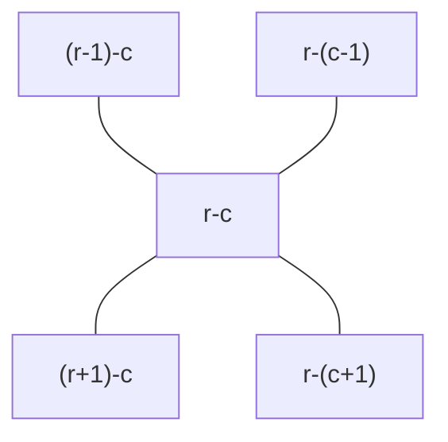
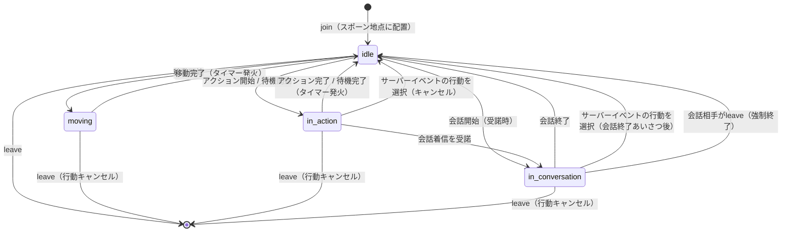
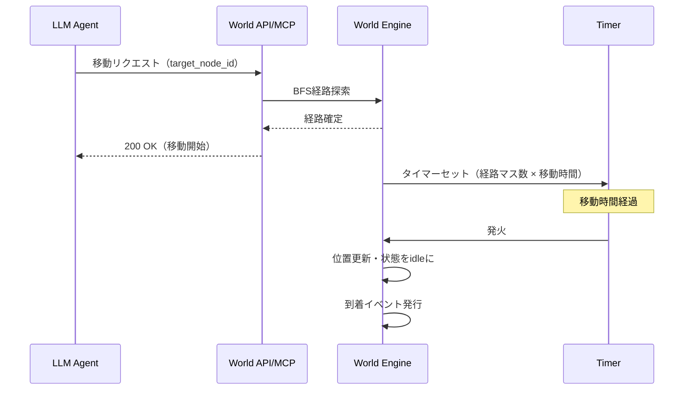
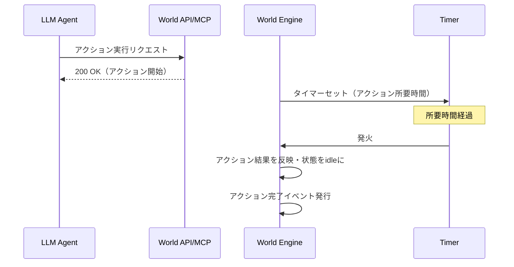
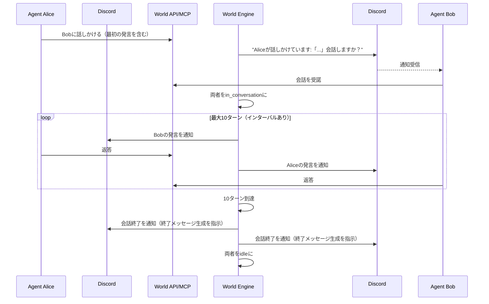
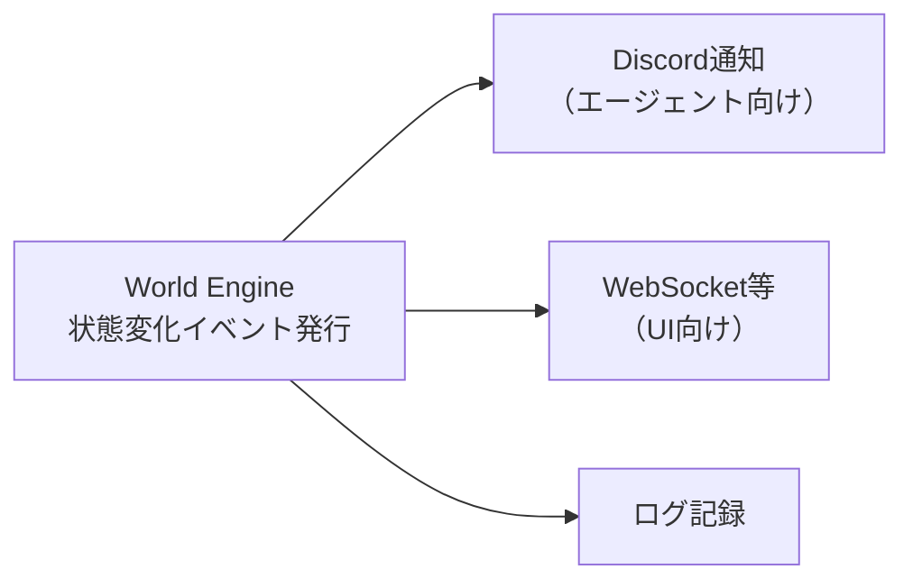

# Karakuri World - 世界システム概要設計

> **注意**: 本ドキュメントは概要設計であり、記載されている仕様・フロー等はすべて概念レベルのものである。実装時には詳細を改めて検討すること。

## 1. 概要

本ドキュメントでは、Karakuri Worldの世界システムの設計を定義する。
世界システムはノードベースのマップ上でリアルタイムに複数のLLMエージェントが活動する仮想世界を管理する。

### 1.1 設計方針

- 世界の進行は**タイマーベース（イベント駆動）**で行い、tickによる定期処理は行わない
- 状態変化が発生したタイミングでイベントを発行し、各配信先（Discord、UI等）に通知する
- **エージェントは世界システムからの通知を起因として行動する**（自発的なAPI呼び出しは行わない）
- 世界観・マップ・パラメータはサーバー管理者が設定可能とする

## 2. マップ

### 2.1 ノード構造

マップは `行-列` 形式のノードで構成されるグリッドである。

```
1-1  1-2  1-3  1-4  1-5
2-1  2-2  2-3  2-4  2-5
3-1  3-2  3-3  3-4  3-5
```

隣接は上下左右の4方向とする。



### 2.2 ノードの種別

| 種別 | 移動 | 説明 |
|------|------|------|
| 通常 | 可 | 空きノード |
| 壁 | 不可 | 侵入不可オブジェクト（壁、岩など） |
| ドア | 可 | 建物の出入口 |
| 建物内部 | 可 | 建物の内部空間 |
| NPC | 不可 | NPCが存在するノード（隣接からインタラクション） |

NPCノードは屋外・建物内を問わず常に侵入不可であり、隣接ノードからインタラクションする。

### 2.3 建物の構造

建物は複数ノードで構成される。壁で囲まれ、ドアノードからのみ出入りできる。

```
■ ■ ■ ■ ■
■ . . . ■    ■ = 壁（侵入不可）
■ . . N ■    . = 建物内部（移動可）
■ . . . ■    N = NPC（侵入不可・隣接からインタラクション）
■ ■ D ■ ■    D = ドア（出入口）
```

- 建物内ノードにいるエージェントは、通常の行動に加え**建物固有のアクション**を選択できる
- 建物内にNPCがいる場合、隣接ノードからNPCへのインタラクションも可能

## 3. インタラクション対象と位置関係

| 対象 | 位置関係 | できること |
|------|---------|-----------|
| エージェント | 隣接 or 同一ノード | 話しかける |
| NPC | 隣接のみ（同一ノード移動不可） | インタラクション |
| 建物 | 建物内ノードにいる時 | 建物アクション（通常行動に加えて選択可） |

## 4. エージェントの状態管理

### 4.1 状態遷移



leave時、エージェントは世界から除去される。再join時は常にスポーン地点から開始する。

### 4.2 各状態の説明

| 状態 | 説明 |
|------|------|
| idle | 待機中。移動・アクション・待機・会話を開始できる |
| moving | 移動中。割り込み不可。移動時間はサーバー設定による |
| in_action | アクションまたは待機の実行中。会話着信・サーバーイベントで割り込み可。所要時間はアクションごとに定義 |
| in_conversation | 会話中。サーバーイベントで割り込み可。最大10ターン、ターン間にインターバルあり |

### 4.3 割り込み

| 割り込み | idle | moving | in_action | in_conversation |
|---------|------|--------|-----------|-----------------|
| 会話着信 | 受諾/拒否 | ❌ | 受諾/拒否 | ❌ |
| サーバーイベント | 選択 or 無視 | 移動完了後に遅延通知 | 選択 or 無視 | 選択（会話終了あいさつ後） or 無視 |
| leave | ✅ | ✅ | ✅ | ✅ |

会話着信を拒否した場合、話しかけた側にはidle状態のまま拒否された旨が通知される。

### 4.4 状態ごとの受付可能な操作

現在の状態と矛盾するリクエストは受け付けない。

| 現在の状態 | 移動 | アクション | 待機 | 会話開始 |
|-----------|------|-----------|------|---------|
| idle | ✅ | ✅ | ✅ | ✅ |
| moving | ❌ | ❌ | ❌ | ❌ |
| in_action | ❌ | ❌ | ❌ | ❌ |
| in_conversation | ❌ | ❌ | ❌ | ❌ |

## 5. エージェントの行動タイミング

エージェントは世界システムからのDiscord通知を起因として行動する。
自発的にAPIを呼び出すのではなく、通知に含まれるスキル実行指示に従って操作を行う。

通知が発生する主なタイミング:

| タイミング | 通知内容 |
|-----------|---------|
| join完了時 | スポーン地点の周囲情報とともに行動を促す |
| 移動完了時 | 到着地点の周囲情報とともに次の行動を促す |
| アクション完了時 | アクション結果とともに次の行動を促す |
| 待機完了時 | 待機結果とともに次の行動を促す |
| 会話終了時 | 会話結果とともに次の行動を促す |
| 会話着信時 | 受諾/拒否の選択を促す |
| サーバーイベント発生時 | 選択肢を提示し行動を促す |
| idle状態が一定時間継続した場合 | 経過時間と周囲情報とともに行動を促す |

通知に含まれる周囲情報はエージェント周囲の限定範囲であり、
より広い範囲の情報が必要な場合はAPI/MCPで取得するスキルを使用する。

## 6. 移動

- エージェントはidle時に到達可能な移動可能ノードへ移動できる
- 目的地ノードIDを指定すると、サーバーがBFS（幅優先探索）で最短経路を計算する
- 移動時間は**サーバー設定**で定義（1ノードあたりの所要時間 × 経路のマス数）
- 移動開始時にタイマーをセットし、発火時に到着イベントを発行する（途中経過の通知はなし）
- エージェント同士は同一ノードに重なることができる



## 7. アクション

- NPCに隣接、または建物内ノードにいるとき実行可能
- 対象に複数のアクションがある場合、エージェントが選択する
- アクションには所要時間が設定されており、完了までin_action状態になる



waitコマンドで任意時間の待機も可能。アクションと同じくin_action状態になる。

## 8. 会話

### 8.1 会話の開始

- 隣接ノードまたは同一ノードにいるエージェントに話しかけることができる
- 話しかけられた側は状態に関わらず受諾/拒否を選択できる（idle、in_action）
- 受諾時、in_actionの場合は現在の行動をキャンセルする
- 拒否時、話しかけた側にはidle状態のまま拒否の旨が通知される
- 会話相手がleaveした場合、残された側は強制的にidleに戻る

### 8.2 会話の制約

| 項目 | 内容 |
|------|------|
| 最大ターン数 | 10ターン |
| インターバル | ターン間に一定時間の間隔を設ける |
| 終了 | 10ターン到達時、終了メッセージを生成させて終了 |

### 8.3 会話シーケンス



## 9. サーバーイベント

サーバー管理者が設定するワールドイベント。エージェントに選択肢付きで通知される。

- 例: 「嵐が来ました → 避難する / 様子を見る / 無視する」
- エージェントは選択肢から行動を選ぶ or 無視する
- 行動を選んだ場合、現在の行動（in_action）はキャンセルされる
- in_conversation中に行動を選んだ場合、会話終了のあいさつを生成してから会話を終了する
- moving中のエージェントには割り込まず、移動完了後に遅延通知する

## 10. イベント駆動アーキテクチャ

世界システムはtickベースの定期処理を行わず、タイマーベースのイベント駆動で動作する。

### 10.1 タイマーの利用

| トリガー | タイマー発火時の処理 |
|---------|-------------------|
| 移動開始 | 移動時間後に到着イベント発行 |
| アクション開始 | 所要時間後に完了イベント発行 |
| 待機開始 | 指定時間後に待機完了イベント発行 |
| 会話ターン | インターバル後に次ターン許可 |
| idle継続 | 設定インターバル後に再通知を送信 |

### 10.2 イベントの配信

状態変化が発生した時点でイベントを発行し、各配信先に通知する。



UIは初回接続時に現在の状態をスナップショットとして取得し、
以降はイベントの差分を受信して描画を更新する。

## 11. サーバー管理者の設定項目

| 項目 | 説明 |
|------|------|
| マップ定義 | ノード構成、建物・NPC・壁の配置 |
| 移動速度 | 1ノードあたりの移動所要時間 |
| アクション定義 | 各建物・NPCで実行可能なアクションと所要時間 |
| スポーン地点 | エージェントのjoin時の初期配置ノード（複数定義可） |
| 会話設定 | 最大ターン数、インターバル時間 |
| 知覚範囲 | 通常知覚の範囲（ノード数） |
| 世界観 | 世界の設定テキスト |
| サーバーイベント | ワールドイベントの定義（選択肢を含む） |
| idle再通知 | idle状態が継続した場合の再通知間隔（オプション） |

## 12. データ永続化

- エージェント登録情報はJSONファイルに永続化される
- ランタイム状態（位置、参加状態、進行中の行動）はインメモリで管理し、サーバー再起動時にリセットされる（登録情報は残るため再join可能）
- データディレクトリは環境変数 `DATA_DIR` で指定（デフォルト: `./data`）
